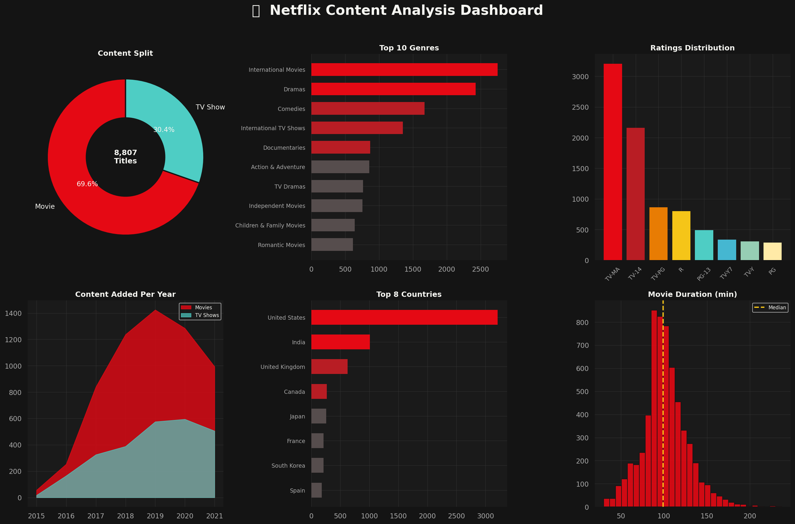
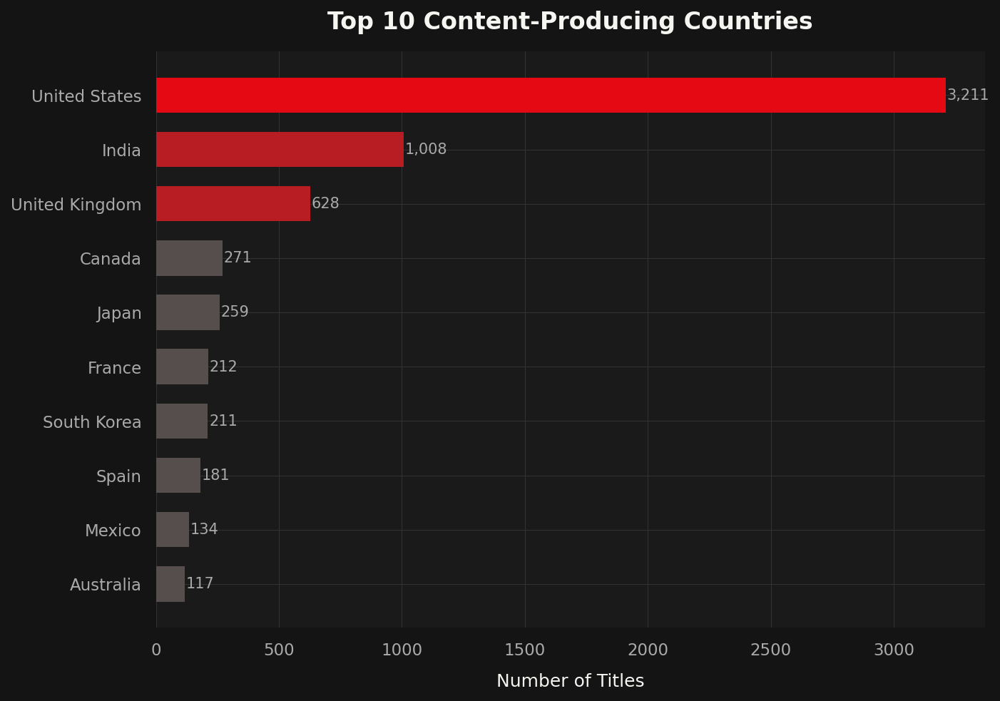

# Netflix Data Analysis (EDA)

A complete Exploratory Data Analysis (EDA) project on Netflix's content dataset to uncover trends in content distribution, genres, ratings, and growth over time.

---

## Objective

To analyze Netflix's catalog and extract meaningful insights about:

* Content growth over time
* Genre popularity
* Country-wise production trends
* Ratings distribution

---

## Key Insights

* 📈 Netflix content peaked around **2019–2020**
* 🎬 Movies dominate (~70%) vs TV Shows
* 🌍 USA is the largest content producer
* 🎭 Drama & International Movies are most common genres

---

##  Dashboard Preview



---
## Output Preview



---

##  Tech Stack

* Python
* Pandas
* NumPy
* Seaborn
* Matplotlib

---

##  Project Structure

```bash
notebooks/   → analysis notebook  
data/        → dataset  
outputs/     → visualizations  
```

---

## ▶️ How to Run

```bash
pip install -r requirements.txt
```

Open notebook in Google Colab or Jupyter.

---

## 💡 What Makes This Project Strong

* Clean data preprocessing pipeline
* Feature engineering (duration, genres, countries)
* 10+ professional visualizations
* Insight-driven analysis (not just plots)

---

## 👨‍💻 Author

Kireeti Dodla
